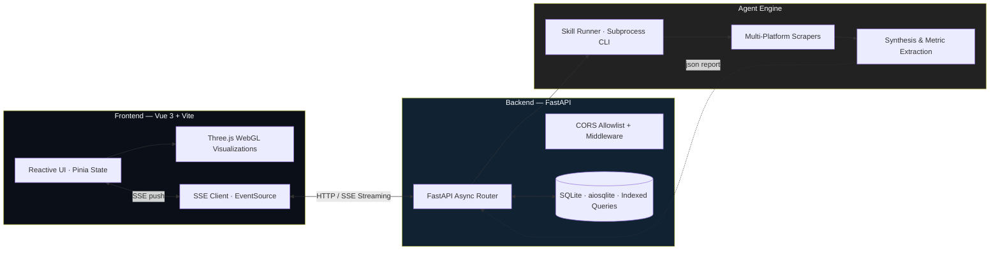

<div align="center">

# Signal Intelligence

### Enterprise 30-Day Trend Aggregator · Agentic Intelligence Engine

*Extracting high-density signals from multi-platform noise using cutting-edge Agent Skills, real-time streaming, and WebGL visualization.*

[](https://python.org)
[](https://fastapi.tiangolo.com)
[](https://vuejs.org)
[](https://vitejs.dev)
[](https://threejs.org)
[](https://docker.com)
[](https://docs.pytest.org)
[](https://vitest.dev)
[](#license)

</div>

---

## 🚀 Live Demo

Experience the platform in production:

- **Live Demo (Frontend):** [https://signal-app-eight-hazel.vercel.app](https://signal-app-eight-hazel.vercel.app)
- **API (Backend):** [https://signal-app-zxbr.onrender.com](https://signal-app-zxbr.onrender.com)

---

## 📋 Executive Summary

**Signal Intelligence** is a production-grade, agentic web platform that aggregates and analyzes **real-time trends** across the internet's major walled gardens — **Reddit, YouTube, GitHub, Hacker News, and TikTok** — over a rolling 30-day window. It delivers **executive-level intelligence reports** via a reactive Vue 3 interface with **live Server-Sent Events (SSE)** streaming and **photorealistic WebGL visualizations**.

Unlike conventional search engines that return SEO-optimized marketing content, Signal Intelligence orchestrates parallel multi-platform extractions, cleanses raw unstructured data, and synthesizes attributed, hallucination-free briefings — with the frontend and backend decoupled behind a hardened, production-ready API.

---

## 🏗️ System Architecture

Signal Intelligence uses a **decoupled, event-driven architecture** engineered for low latency, controlled connection lifecycle, and strict process isolation.



```text
 ┌───────────────────────────────┐
 │   FRONTEND (Vue 3 + Three.js) │
 │  Pinia · Theme/i18n · SSE(c)   │
 └───────────────┬───────────────┘
                 │ HTTP REST + Server-Sent Events
 ┌───────────────▼───────────────┐
 │        FASTAPI BACKEND         │
 │  Async Router · CORS Allowlist │
 │  SQLite (aiosqlite) · Indexed  │
 └───────────────┬───────────────┘
                 │ Async Subprocess (PYTHONUTF8=1 isolation)
 ┌───────────────▼───────────────┐
 │       AGENT ENGINE            │
 │  last30days Skill Runner      │
 │  Reddit · YouTube · GitHub ·  │
 │  Hacker News · TikTok         │
 └───────────────┬───────────────┘
                 ▼
        Executive Markdown Report
```

---

## ✨ Core Capabilities

| Capability | Technical Description |
| :--- | :--- |
| **Agentic Multi-Platform Aggregation** | Orchestrates the `last30days` Agent Skill across Reddit, YouTube, GitHub, Hacker News, and TikTok, restricted to a rolling 7/15/30-day window to isolate active momentum. |
| **Real-Time SSE Streaming** | Live token/feed delivery over **Server-Sent Events** with **controlled connection cancellation** — the SSE stream is closed on component unmount and on explicit abort, preventing orphaned connections and resource leaks. |
| **Reactive WebGL Interface** | Photorealistic interactive **Three.js / GLSL** orb and ambient mesh background, with an executive dark (Slate Obsidian) and light theme engine plus full EN/ES i18n. |
| **Sanitized Markdown Rendering** | All feed/report content is rendered through a centralized `renderMarkdown` pipeline using **DOMPurify** against a strict allowlist, neutralizing XSS payloads before insertion into the DOM. |
| **Report Export & Indexed Persistence** | Executive reports and chat threads persisted to **SQLite**; history queries filter in SQL (index-friendly `ILike`) rather than in application memory, and downloadable report export revokes its object URL after use. |

---

## 🔐 Security & Production Hardening

Signal Intelligence is hardened around real-world deployment concerns:

- **XSS Mitigation:** All user- and scraper-generated content is rendered via **DOMPurify strict sanitization** behind a centralized markdown utility — no raw HTML from any source is ever injected into the DOM.
- **Restricted CORS:** Middleware enforces an **explicit allowlist** sourced from the `ALLOWED_ORIGINS` environment variable instead of a wildcard (`*`), with credentials disabled — shutting down cross-origin abuse in production.
- **Sanitized `/health` Endpoint:** The health probe reports status and boolean configuration flags only. It exposes **zero absolute host paths and no interpreter or system internals** (`sys.executable` and filesystem paths are removed), preventing infrastructure reconnaissance.
- **Repository Hygiene:** Strict `.gitignore` excludes `.env`, `*.pyc`/`__pycache__`, `node_modules`, `dist/`, and local SQLite databases — secrets and build artifacts are never committed. Containerized and local deployments read configuration purely from environment or `.env`.

---

## 🧱 Technology Stack

| Layer | Technology |
| :--- | :--- |
| **Backend** | Python 3.11+ · FastAPI · SQLAlchemy + aiosqlite · SQLite |
| **Frontend** | Vue 3.4 · Vite 5.4 · Pinia · Tailwind CSS |
| **Visualization** | Three.js / WebGL · GLSL shaders |
| **Streaming** | Server-Sent Events (SSE) · EventSource |
| **Testing** | Pytest + pytest-asyncio (backend) · Vitest + happy-dom + Vue Test Utils (frontend) |
| **DevOps / Tooling** | Docker & Docker Compose · Vercel (frontend) · Render (backend) · `start.sh` / `start.ps1` |

---

## 🚀 Getting Started

### Prerequisites

- **Python:** 3.11 or higher
- **Node.js:** 18 or higher
- **Git**
- *(Optional)* **Docker** + **Docker Compose** for containerized run

### 1. Clone the Repository

```bash
git clone https://github.com/esmoliname/signal-app.git
cd signal-app
```

### 2. Backend (FastAPI)

```bash
cd backend
python -m venv venv

# Activate:
#   Windows PowerShell: .\venv\Scripts\Activate
#   macOS / Linux:      source venv/bin/activate

pip install -r requirements.txt      # runtime deps
pip install -r requirements-dev.txt  # test deps (pytest, pytest-asyncio)

cp .env.example .env                 # configure environment (see below)

python -m uvicorn app.main:app --reload --port 8000
```

### 3. Frontend (Vue 3 / Vite)

```bash
cd ../frontend
npm install
cp .env.example .env                 # configure VITE_API_BASE_URL

npm run dev
```

> Open [http://localhost:5173](http://localhost:5173) in your browser.

### 4. Docker (Recommended for Production-shaped Local Runs)

```bash
# From the repository root:
docker-compose up --build
```

### 5. One-Command Startup Scripts

```bash
# macOS / Linux:
./start.sh

# Windows PowerShell:
.\start.ps1
```

---

## 🔧 Environment Configuration

### Backend (`.env`)

```dotenv
# Server
HOST=0.0.0.0
PORT=8000
ALLOWED_ORIGINS=http://localhost:5173,http://localhost:3000,http://127.0.0.1:5173

# AI & External Services
OPENAI_API_KEY=
ANTHROPIC_API_KEY=
GEMINI_API_KEY=

# Agent Skill
LAST30DAYS_SKILL_PATH=~/.agents/skills/last30days

# Database & Cache
DATABASE_URL=sqlite+aiosqlite:///./signal_cache.db
CACHE_TTL_HOURS=12
TIMEOUT_SECONDS=120
```

> `ALLOWED_ORIGINS` is a comma-separated allowlist consumed by the CORS middleware. Set it to your real frontend origin(s) in production.

### Frontend (`.env`)

```dotenv
VITE_API_BASE_URL=http://localhost:8000
```

---

## ✅ Testing & Validation

### Backend Tests (Pytest)

```bash
cd backend
# ensure venv is active
pytest
```

Runs the API, configuration, and skill-runner suites with **pytest-asyncio** support.

### Frontend Tests (Vitest)

```bash
cd frontend
npm run test        # runs: vitest run
```

Covers the API client, history store, markdown sanitization, and theme composable behaviours.

### Frontend Production Build

```bash
cd frontend
npm run build
```

Output is emitted to `frontend/dist` — deploy this directory to Vercel, Netlify, or Cloudflare Pages. The build applies `manualChunks` code-splitting to keep vendor bundles (`three`, `marked`, `dompurify`, etc.) independently cached.

---

## 📚 API Reference

### `POST /api/research`

Triggers an asynchronous research job via the `last30days` skill engine.

```json
{
  "topic": "DeepSeek R1",
  "days": 30,
  "sources": ["reddit", "youtube", "hackernews", "github", "tiktok"],
  "bypass_cache": false
}
```

### `GET /api/history`

Retrieves all stored research sessions from SQLite (filterable by query, filtered in SQL).

### `DELETE /api/history/{task_id}`

Permanently deletes a research session.

### `POST /api/research/{task_id}/chat`

Sends a contextual follow-up query bound to an existing research task.

---

## 📁 Directory Structure

```text
signal-app/
├── backend/
│   ├── app/
│   │   ├── api/          # FastAPI route handlers & SSE endpoints
│   │   ├── core/         # Subprocess CLI runner, config & JSON parser
│   │   ├── db/           # SQLite models & session handlers
│   │   └── main.py       # App setup, CORS allowlist & middleware
│   ├── tests/            # Pytest suite (API, config, skill runner)
│   ├── Dockerfile
│   ├── requirements.txt      # Runtime dependencies
│   ├── requirements-dev.txt  # Test dependencies
│   └── pytest.ini
├── frontend/
│   ├── src/
│   │   ├── components/   # Vue SFCs (HologramOrb, Metrics, ResearchForm, Chat)
│   │   ├── composables/  # Theme management & i18n reactive dictionaries
│   │   ├── services/     # Centralized HTTP API client (+ SSE)
│   │   ├── stores/       # Pinia history & session management
│   │   ├── utils/        # DOMPurify-sanitized markdown renderer
│   │   ├── __tests__/    # Vitest suite
│   │   └── views/        # Main Dashboard layout
│   ├── Dockerfile
│   ├── package.json
│   └── vite.config.js    # Code-splitting build + vitest config
├── docker-compose.yml
├── start.sh              # Cross-platform startup script
├── start.ps1             # Windows PowerShell startup script
└── README.md
```

---

## License

This project is licensed under the [MIT License](https://www.google.com/search?q=LICENSE).
